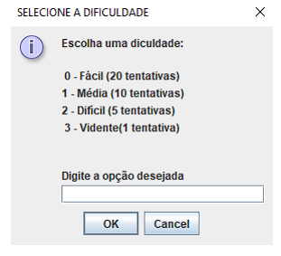
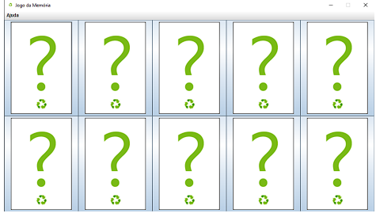
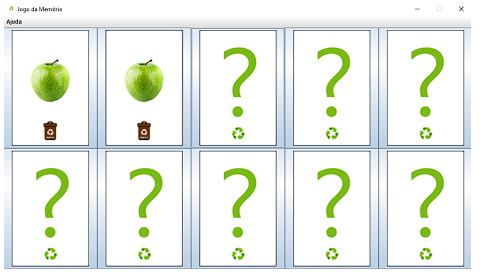
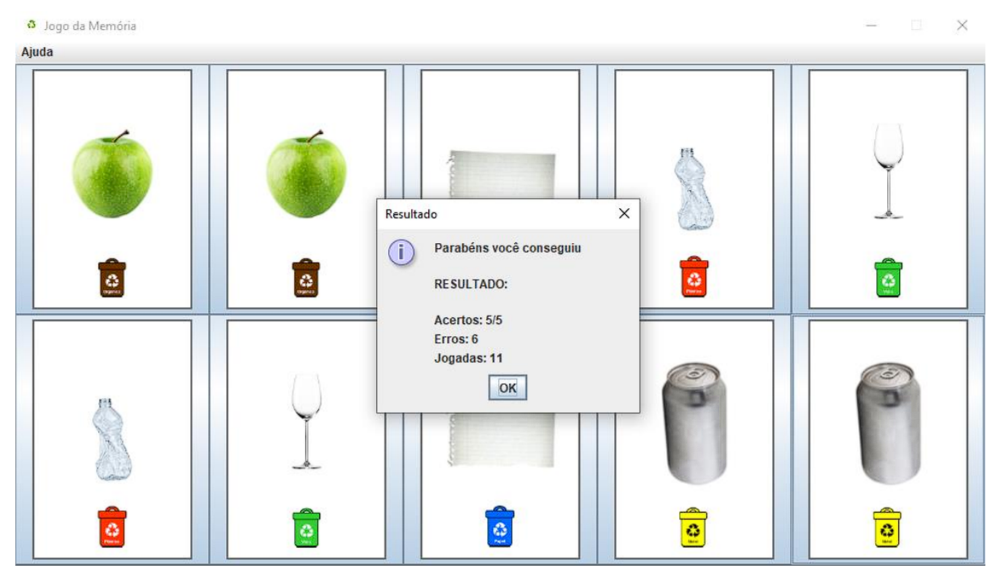
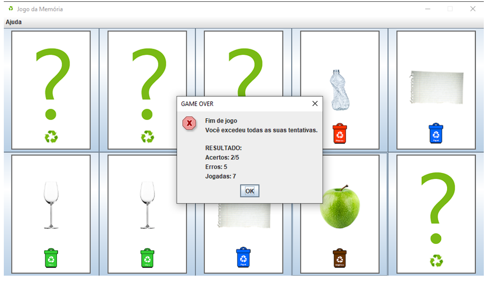

# Jogo da memória

## Sobre
___

A Atividade Prática Supervisionada (APS) do 3º semestre tem como principal 
objetivo a criação de um jogo utilizando os conceitos de linguagem de programação 
orientada a objetos aprendidos em sala de aula. Tendo como tema a conscientização 
ambiental e a sustentabilidade nas grandes metrópoles.

Para isso foi desenvolvido um jogo da memória tendo como foco principal a 
educação sobre o descarte correto do lixo, algo que hoje em dia não é muito praticado nas casas dos brasileiros, nem tão pouco noticiado com frequência.

O jogo tem como objetivo mostrar os tipos de lixos recicláveis que encontramos 
em nosso cotidiano bem a cor de sua respectiva lixeira, algo que embora pareça muito simples, nem todos sabem ao certo o correto uso ou qual cor pertence a quem.

Usando todos os conceitos de orientação a objetos que foram obtidos através 
das aulas ao longo do semestre, foi possível desenvolver um simples jogo utilizando uma interface gráfica para facilitar a apresentação de tudo aquilo que foi codificado

## Programa em execução
___
 

 

 

 

 
